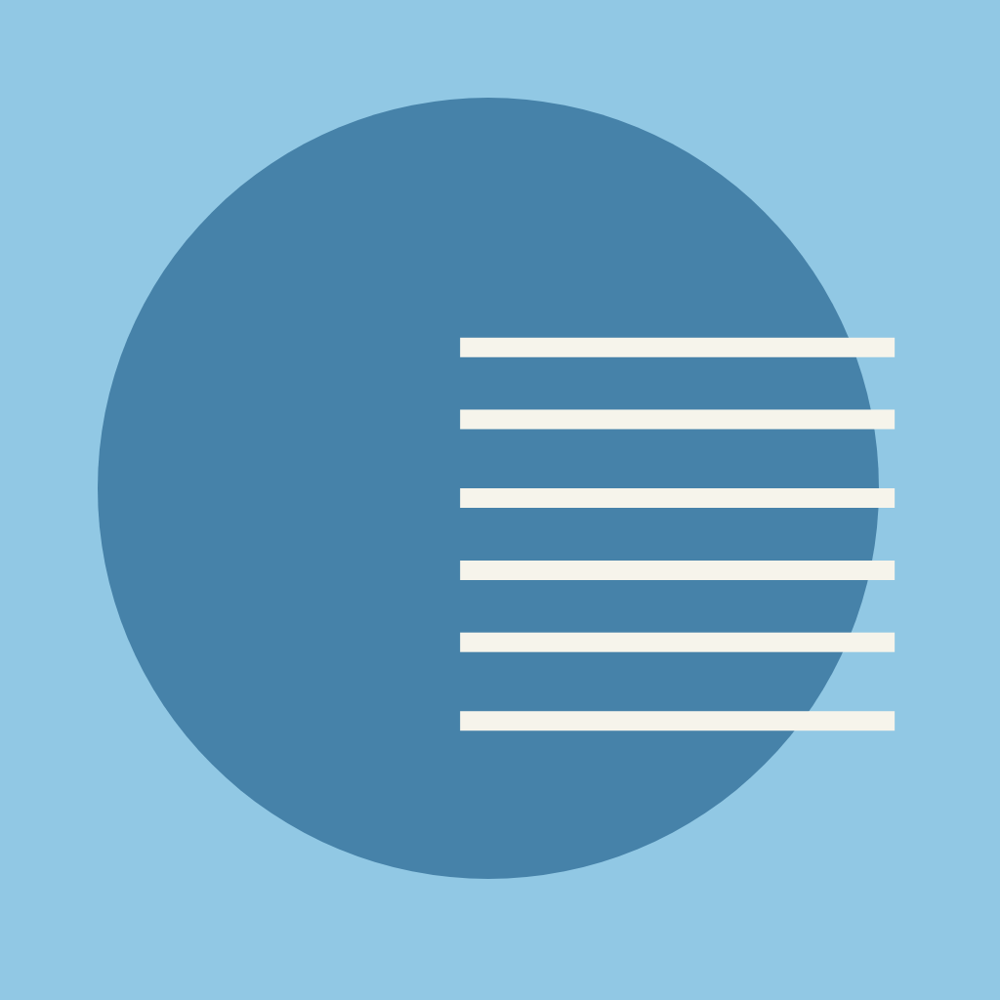
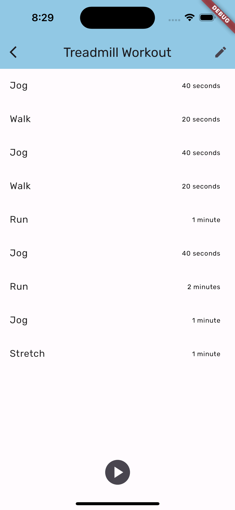
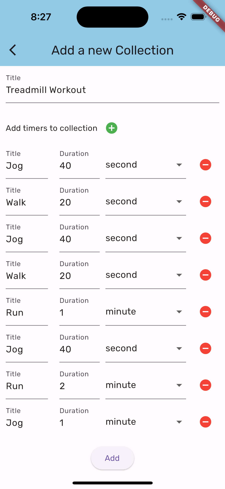
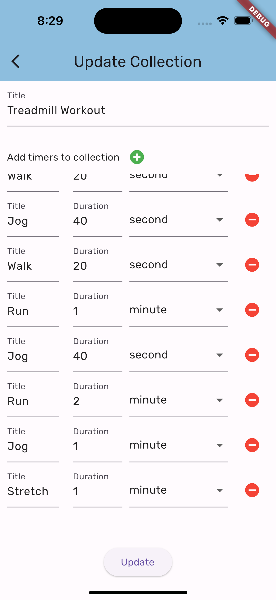

# List Timer

I (<i>sometimes</i> ﾉ≧ڡ≦) do treadmill workout which consists of multiple segments (e.g. jog for 60 seconds, walk for 40 seconds and stretch for 40 seconds) so I need multiple timers at once. Unfortunately my iPhone timer app is <i>kinda baka</i> as it can't do such simple task like that (at the moment) therefore I made this simple app. And voilà!

List Timer is a timer app with list for Android and iOS built using Flutter. The main function of this app is to have multiple timers at once and read the timers out loud before it starts. For example in my treadmill workout case, I can set a <em>collection</em> of multiple <em>timers</em>: jog for 60 seconds, walk for 40 seconds and stretch for 40 seconds. When you play the collection, the app will read jog, walk after 60 seconds and stretch after 40 seconds.

    
    &nbsp;&nbsp;&nbsp;
    

## Features

The app's main objective is to have multiple timers at once and to read all the timers out loud. Here are all features of the List Timer app.
* Play your collection of timers by tapping the play button.
* You can have as many timers as you want in your collection. Add a new timer as needed.
* Update your collection any time you want. If you spot a mistake in your collection, just update it with ease.
* All collections previously made are automatically saved on your phone's local disk.

    
    &nbsp;&nbsp;
    
    &nbsp;&nbsp;
    

Some other features that are going to be implemented in this app as well. Here are some features currently sitting in my wishlist.
* Add more customizations to the app.

## How to Run

1. Install <a href="https://docs.flutter.dev/get-started/install">Flutter</a> and set up your preferred IDE (Mine is <a href="https://code.visualstudio.com">Visual Studio Code</a>). Also set up your preferred device simulator between Android and iOS devices.
2. Clone the repository and open it as a project in your preferred IDE.
3. Install all required dependencies by using this command:
<code>flutter pub add [package-name]</code>.
4. Run the app through the `main.dart` file using the `main()`. Select your preferred device simulator between Android and iOS devices.

## Dependencies

This app is built using Flutter and is dependant on some other packages in order to work. Here are some packages used by this app.

* <a href="https://pub.dev/packages/google_fonts">google_fonts</a>: > 5.1.0
* <a href="https://pub.dev/packages/uuid">uuid</a>: > 3.0.7
* <a href="https://pub.dev/packages/path">path</a>: > 1.8.3
* <a href="https://pub.dev/packages/url_launcher">url_launcher</a>: >6.1.12
* <a href="https://pub.dev/packages/flutter_tts">flutter_tts</a>: > 3.7.0
* <a href="https://pub.dev/packages/sqflite">sqflite</a>: > 2.3.0
* <a href="https://pub.dev/packages/riverpod">flutter_riverpod</a>: > 2.3.6

## Lincense

Distributed under the MIT Lincese. See `LICENSE` for more information.
